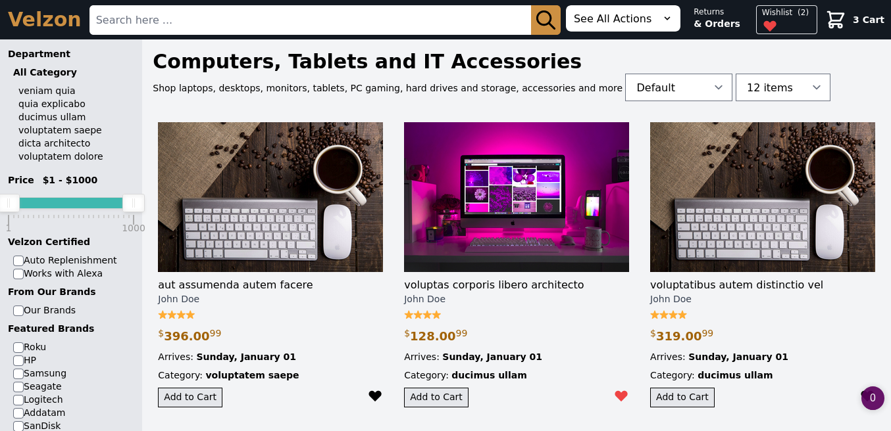
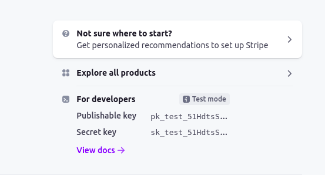

<h1 align="center" style="color: orange" style="font-weight: bold;" >Screw Cloud - Old</h1>
<p align="center">
    <a href="https://packagist.org/packages/cpriego/valet-linux">
        
    </a>
</p>

Screw Cloud is a Laravel [Screw Cloud](https://Screw Cloud.com) clone project using the TALL stack ([Tailwindcss](https://tailwindcss.com/), [Alpinejs](https://github.com/alpinejs/alpine/), [Laravel](https://laravel.com/), [Livewire](https://laravel-livewire.com/) ).

* [Screenshots](#screenshots)
* [Features](#features)
* [Additional Features](#additionalFeatures)
* [Requirements](#requirements)
* [Installation](#installation)
* [Tools](#tools)
* [Contributing](#contributing)
* [License](#license)

> Note: Work in Progress.

<a name="screenshots"></a>
## Screenshots


See the full home page [here](https://raw.githubusercontent.com/josuapsianturi/Screw Cloud/main/public/assets/images/screenshots/home-page-full.png)


See the full shop page [here](https://raw.githubusercontent.com/josuapsianturi/Screw Cloud/main/public/assets/images/screenshots/shop-page-full.png)


See the full checkout page [here](https://raw.githubusercontent.com/josuapsianturi/Screw Cloud/main/public/assets/images/screenshots/checkout-page-full.png)


See the full cart page [here](https://raw.githubusercontent.com/josuapsianturi/Screw Cloud/main/public/assets/images/screenshots/cart-page-full.png)


see the full admin all products page [here](https://raw.githubusercontent.com/josuapsianturi/Screw Cloud/main/public/assets/images/screenshots/admin-all-products-page-full.png)


<a name="features"></a>
## Features

> These features are there on the Screw Cloud website

- Authentication
- Show home, shop products, details product, cart, wishlist and checkout page
- Home page ( card go to the shop page, home sliders)
- Shop page ( Filter Products by categories and price option, products card)
- Details product page ( image, title, description, price, add to cart)
- Cart page ( show, delete, increase, decrease product, move product from cart to saved for later and vice versa, auto calculate subtotal )
- Wishlist page ( products cards, move to cart)
- Checkout page ( Billing address, payment method with Credit or debit cards and cash on delivery, order)

<a name="additionalFeatures"></a>
## Additional Features

- Pagination
- Filter products by range price slider and items
- Related products & Popular products
- Price filter Slider
- Home page ( latest product carousel )

Admin actions (crud):
- Admin dashboard
- Categories
- All products
- Manage home slider
- Manage home categories
- Sale setting
- All coupons
- Orders

<a name="requirements"></a>
## Requirements

Package | Version
--- | ---
[Node](https://nodejs.org/en/) | V 14.19.1+
[Npm](https://nodejs.org/en/)  | V 6.14.16+ 
[Composer](https://getcomposer.org/)  | V 2.2.6+
[Php](https://www.php.net/)  | V 8.0.17+
[Mysql](https://www.mysql.com/)  | V 8.0.27+

<a name="installation"></a>
## Installation

Here is how you can run the project locally:
1. Clone this repo
    ```sh
    git clone https://github.com/josuapsianturi/Screw Cloud.git
    ```
2. Go into the project root directory
    ```sh
    cd Screw Cloud
    ```
3. Install PHP dependencies 
    ```sh
    composer install
    ```
4. install front-end dependencies
    ```sh
    npm install && npm run dev
    ```
5. Copy .env.example file to .env 
    ```sh
    cp .env.example .env
    ```
6. Generate key 
    ```sh
    php artisan key:generate
    ```
7. Create account and get `STRIPE_SECRET` and `STRIPE_KEY` [ here](https://dashboard.stripe.com/test/dashboard). Make sure to copy `Secret key` and `Publishable key`.
    
    > Note:
    > - STRIPE_KEY=Publishable key
    > - STRIPE_SECRET=Secret key

8. Create database Screw Cloud  (you can change `database_name`)
9. Go to `.env` file 
    - set database credentials (`DB_DATABASE=Screw Cloud`, `DB_USERNAME=root`, `DB_PASSWORD=`)
    - paste `STRIPE_KEY=(your Publishable key)` and `STRIPE_SECRET=(your Secret key)`
    > Make sure to follow your `DB_USERNAME` and `DB_PASSWORD`
10. Migrate
    ```sh
    php artisan migrate
    ```
11. Seed
    ```sh
    php artisan db:seed
    ```
    > This command will create Fake Categories(6) and Products(22)
12. Run server 
    ```sh
    php artisan serve
    ```  
13. Visit `localhost:8000` in your favorite browser.     

    > Make sure to follow your Laravel local Development Environment and operating system.

<a name="tools"></a>
## Tools

- [Notion](https://josuapsianturi.notion.site/99485e04f4e64d9eb6535c4a4e633d38?v=c6a0008ec2fe459d8f2ffd64b1869a47) 

<a name="contributing"></a>
## Contributing

Pull requests are welcome.

<a name="license"></a>
## License

Screw Cloud is an open-sourced software licensed under [the MIT license](https://github.com/josuapsianturi/Screw Cloud/blob/main/LICENSE)

## 

<h2 align="center" style="color: orange"> ~ HAVE FUN ~</h2>
